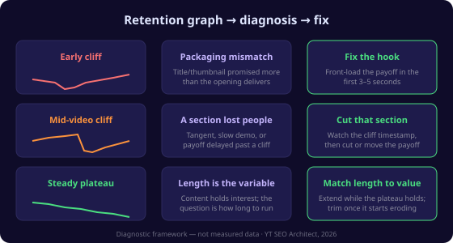
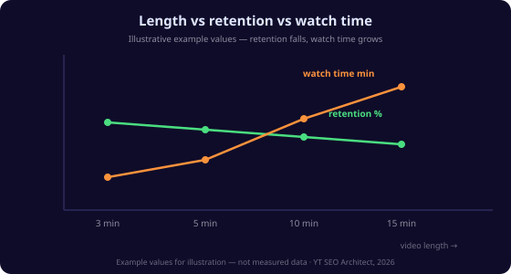

# YouTube Retention Graph Explained: How to Read It and Fix Your Drops in 2026

Your retention graph is the most honest page in YouTube Analytics. Views can be flattered by a good thumbnail, impressions can be flattered by a hot topic, but the retention curve shows you exactly how many viewers were still watching at every second — no spin, no interpretation, just the truth about whether your video delivers on its promise.

Here's the answer up front: **a healthy retention graph is a plateau that drops slowly and steadily.** A sharp cliff in the first minute is a packaging problem (your title and thumbnail promised something the video doesn't deliver). A sharp cliff in the middle is a structure problem (a section that loses interest). And a graph that holds above 60% relative retention deep into the video is the signal that tells the algorithm, "this video is worth showing to more people."

This guide walks the whole curve: what each zone means, how to tell your problem from the shape of the line, and the exact fixes for the three most common patterns. You'll finish knowing how to read any retention graph in under a minute and what to change first.

> **Key Takeaways**
> - The retention graph shows **percentage of viewers still watching at each second** — it's the one metric you can't game with packaging.
> - An **early cliff** (first minute) = packaging promise mismatch; fix the hook, not the content.
> - A **mid-video cliff** = a section is losing people; cut or move the payoff.
> - A **steady plateau** is the goal — it's what the algorithm rewards most.
> - Read retention **together with CTR and watch time**; each metric points to a different fix.

## What the Retention Graph Is

**Retention** is the percentage of viewers who are still watching your video at any given second. **Average view duration** is the mean watch time across all viewers. **Watch time** is the total — average duration multiplied by views. These three numbers are the vocabulary of the retention graph, and they answer different questions: retention tells you *where* people leave, duration tells you *how much* they stayed, and watch time tells you the *total* attention the video earned.

The graph itself plots retention on the vertical axis and time on the horizontal axis. A flat line at the top would mean every viewer watched every second — that never happens. Real graphs fall. The question is how fast, where, and whether the fall is steady or punctuated by cliffs.

## The Four Zones of a Retention Graph

Read any retention graph by looking at four things in order:

| Zone | Where | What it tells you |
|---|---|---|
| **The intro spike** | First 5–30 seconds | A visible spike means a hook that earned attention — but only relative to the video's own baseline |
| **The early cliff** | First minute | Viewers who leave here clicked on the promise (title/thumbnail) but the video didn't deliver it fast enough |
| **The mid-video falls** | Middle sections | Each distinct drop marks a section that lost interest — the bigger the drop, the weaker the section |
| **The payoff plateau** | Late video | If viewers survive the middle, they usually stay — a healthy late plateau means the payoff landed |

Most beginners only look at the overall average. The shape tells you far more than the number: a 40% average with a steady plateau is a healthy video that's slightly long; a 40% average with an early cliff is a video that lost half its audience in the first 30 seconds and will never recover.

## The Three Common Curve Shapes

[CHART: three retention curve shapes — steady plateau, early cliff, mid-video cliff]

**1. The steady plateau.** The graph falls slowly and evenly, losing a few percentage points per minute. This is the healthiest shape. It means every section holds interest. If this is your video, your opportunity is usually length — the same content stretched past the point viewers stop staying. [INTERNAL-LINK: check your length vs retention → video length optimizer at /tools/video-length-optimizer]

**2. The early cliff.** The graph drops sharply in the first 15–60 seconds, then flattens. This is the classic packaging mismatch: your title and thumbnail won the click, but the video didn't deliver the promised payoff quickly enough. The fix is the intro, not the body. [INTERNAL-LINK: rebuild your first three seconds → intro hook guide at /tools/youtube-intro-hook-first-3-seconds]

**3. The mid-video cliff.** The graph holds through the intro, then drops sharply at a specific timestamp, then holds again. Something at that exact point lost people — a long tangent, a sponsor read, a slow demonstration, a section that didn't match the title's promise. Open the graph, click the drop, and watch those exact seconds. Cut or move the payoff. [INTERNAL-LINK: find where your retention breaks → audience retention benchmark at /tools/audience-retention-benchmark]

## How to Read the Drop Points

The drop points are the most actionable data in your entire analytics suite. When you hover over a retention graph, YouTube shows you the relative retention at that second — the percentage compared with all videos of similar length.

Interpretation rule of thumb: **any cliff where relative retention drops is a place people actively rejected the content.** A gradual slope is normal. A vertical-looking cliff is a decision point — the moment a viewer decided "this isn't for me."

Open the video at each major cliff and watch 15 seconds before and 30 seconds after. You will almost always find one of three things: a slow intro, a promise that was set up but not paid off, or content that doesn't match the title's stated topic.

## Retention vs CTR vs Watch Time — How They Connect

Retention doesn't exist in isolation. It works with the two other numbers YouTube's algorithm reads on every video:

- **Impressions** — how many people YouTube showed the video to.
- **CTR** — how many of those clicked your thumbnail. CTR is a packaging metric; low CTR means your title/thumbnail aren't earning the click. [INTERNAL-LINK: measure your impressions and CTR → CTR calculator at /tools/ctr-impressions-calculator]
- **Retention** — how many of those who clicked stayed. Retention is a content metric; a cliff here means the content didn't hold the click it earned.

The algorithm weighs all three together. A video with high CTR and low retention gets shown to fewer people over time, because clicks that don't produce watch time are the signal that the packaging oversold the content. A video with modest CTR but strong retention gets pushed wider, because YouTube trusts it to keep people on the platform. [INTERNAL-LINK: read all four metrics together → analytics guide at /blog/youtube-analytics-explained-2026]

## Fix the Early Cliff: the Hook

If your graph drops hard in the first minute, the problem is almost always that the video doesn't pay off its own promise quickly enough. Viewers came for the title's promise — the exact answer, the specific result — and instead got an intro, a recap of who you are, or context they didn't ask for.

The fix is a front-loaded hook: in the first 3 seconds, either show the result you promised or state the answer you're going to deliver. Nothing else. Your first 30 seconds should be the most information-dense part of the video, not the least. If the first thing a viewer hears is a promise they can verify by staying, the early cliff becomes a plateau.

## Fix the Mid-Video Cliff: Structure and Payoff

A mid-video cliff means a specific section lost people. The fix is surgical, not global:

1. **Find the cliff timestamp** on the graph.
2. **Watch the 60 seconds around it.** Name what happens there — tangent, slow demo, sponsor read, repeated point.
3. **Cut or relocate.** Remove the dead section, or move the payoff of that section to the top so the value lands before the digression.
4. **Re-upload the improved cut** and compare the graphs on your next version.

Mid-video cliffs compound: every person who leaves at minute 3 is gone for the rest of the video, so one bad minute in the middle can halve your final retention. Fixing the single worst cliff is the highest-impact edit most videos can receive.

## Retention and Video Length

Retention percentage falls as length rises — that's arithmetic, not failure. A 15-minute video with 50% retention kept viewers for 7.5 minutes; a 3-minute video with 50% retention kept them for 90 seconds. The absolute watch time matters more than the percentage for a single video, but the *shape* still matters for ranking.

The strategy question is whether your topic deserves its length. If your plateau holds for 4 minutes then erodes, your video is the right length for its best content and too long for everything after it. If the plateau holds the whole way, the video could sustain more — extend it with the sections viewers actually stayed for. [INTERNAL-LINK: benchmark your retention against similar videos → retention benchmark at /tools/audience-retention-benchmark]

## Worked Example: Reading One Graph

Imagine a video called "How to Rank #1 on YouTube in 2026" that got 100,000 impressions, 6% CTR (6,000 clicks), and this retention shape: a steep drop from 100% to 45% in the first 40 seconds, a flat plateau at 45% until minute 3, another drop to 30% at minute 4, then a slow decline to 22% at the end.

Reading it: the early cliff to 45% means the title and thumbnail promised a specific ranking method, but the first 40 seconds delivered setup instead of the method. The flat plateau from 40 seconds to 3 minutes means the content that did play was genuinely holding people. The drop at minute 4 marks a section — likely a tangent or an ad — that lost a third of the remaining audience.

The fix, in order: (1) re-cut the intro so the ranking method appears in the first 15 seconds; (2) cut or tighten whatever sits at minute 4; (3) re-upload and watch whether the early cliff becomes a plateau. That single edit would raise both the percentage and the watch time that drive the algorithm's decision.

## Frequently Asked Questions

### What is a good YouTube retention rate?

A good average retention is roughly 40–60%, but the number matters less than the shape. A video with 50% average retention and a steady plateau is healthier than one with 50% and an early cliff, because the plateau means viewers stayed consistently rather than rejecting the intro. Benchmark against videos of similar length and your own past performance, not against a universal number.

### Why does my retention drop in the first 30 seconds?

Because the first 30 seconds is where viewers decide whether the video matches the click they just made. A sharp early drop means your title and thumbnail promised something the opening didn't deliver. Front-load the payoff — show the result or state the answer in the first 3–5 seconds — and the early cliff usually becomes a plateau.

### How do I find out where people leave my video?

Open your video in YouTube Analytics, go to Engagement → Audience retention, and click the graph. Hover over the dips to see relative retention at each timestamp. Then open the video at the biggest drop and watch 15 seconds before and 30 seconds after to identify exactly what caused it.

### Does a longer video with lower retention still rank?

Yes, if the watch time is higher. The algorithm weighs total watch time and session time, not just percentage retention. A 15-minute video holding 50% delivers more watch time than a 3-minute video holding 60%. The failure mode is length with *unheld* minutes — retention that erodes because the extra time adds no value.

### Should I re-upload a video after fixing the retention problem?

Careful — don't delete and re-upload the same video to reset stats; that's a pattern YouTube treats as spammy. Instead, apply the fix to the original if it's recent, or publish an improved sequel. If the video is underperforming and new, editing the existing upload is safer than re-uploading and risking duplicate-content penalties.

## Conclusion

The retention graph is the closest thing YouTube gives you to an honest mirror. A plateau means the content holds; a cliff means a promise was broken, a section was weak, or the video was longer than its best minutes. Read the shape before the number, find your worst cliff, fix the seconds around it, and re-measure.

Start with your worst-performing recent video: open the retention graph, identify the single biggest drop, and watch those 60 seconds. Then apply the fix to your next upload and compare the curves.

[INTERNAL-LINK: run the free tools → full suite at /tools]
